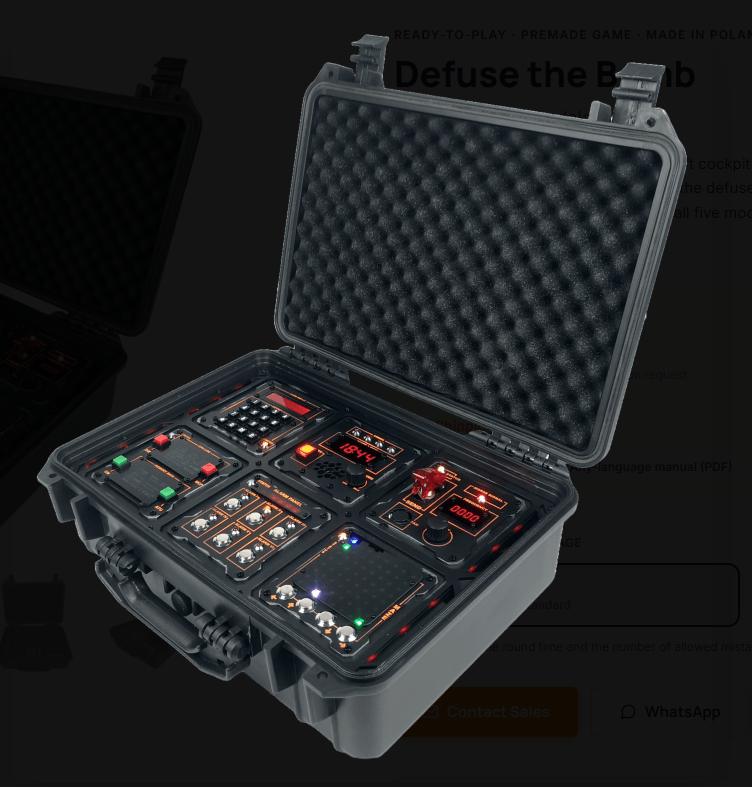

# BOMB-Case Game

---

---

This project was a school related project, performed by multiple student teams. The goal was to recreate a bomb-case game like shown in the picture from casecore games. Ech student team needed to come up with a concept for, and design of an individual module. However, nobody was assigned the task of making the whole game to work as one unit. I took the opportunity to work out embedded software that included the main game logic, a prototype user interface using an led strip and switches, and the bidirectional communication (I2C) between all modules and the game master. The master game controller (raspberry pi pico) follows a game booting sequence in which it scans for all modules by their I2C address and reports active and missing modules. The modules are also checked if it is a module that is active during the whole game, or if it is a module that can be completed. All modules also receive a game order in which they will be activated. After booting, the master game controller follows a well defined game state machine that alongside the booting keeps track of the game state that takes form in the user score, user mistakes, completing or failing the game. 
The full game was verified working with 2 out of 9 modules, which left this project in a well pepared state for finishing in the second iteration of this project, which will be done by other students.
