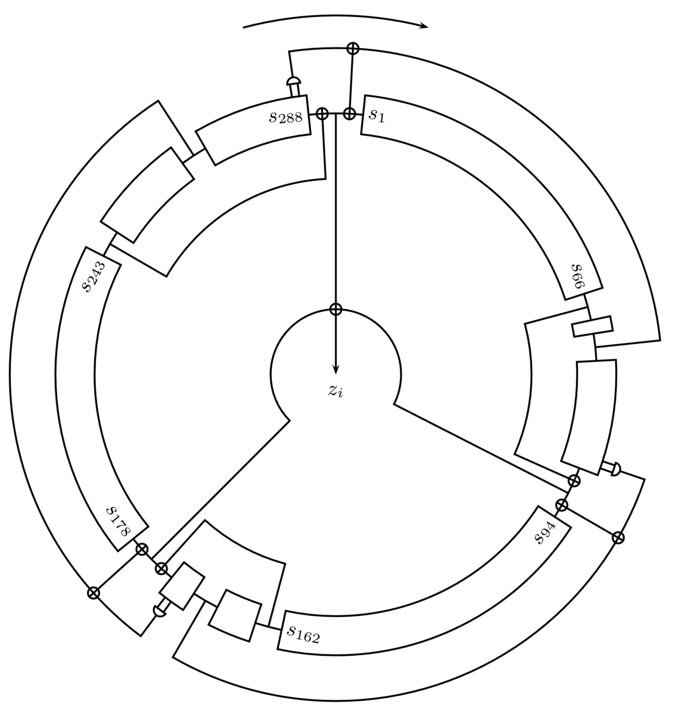
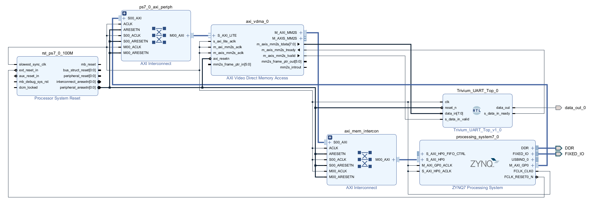
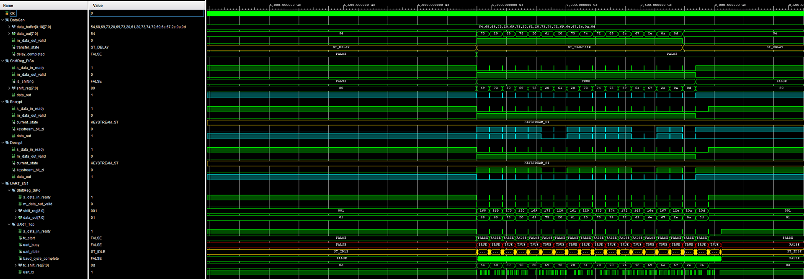

# FPGA RTL Trivium Encryption

---

<table border="0">
  <tr>
    <td align="center">
      
    </td>
    <td>
      This project concludes the development of an FPGA RTL encryption IP. On suggestion by one of my teachers F. Vreys, the encryption cipher of choice is the Trivium synchronous stream cipher.
    </td>
  </tr>
</table>

---

The hardware design consists out of the components which can be seen in the blockdesign. The design mainly exists out of a 4 subsystems: Processing Unit, VDMA, Trivium encryption/decryption and UART Tx.
As this  is just a proof of concept, the processing unit stores a fixed ASCII string in DDR and configures the VDMA for this address range. The VDMA is also configured to operate in a circular buffer mode, thus repeating the same fixed ASCII string. The choice of VDMA over  normal DMA is used as this design will eventually be used as the basis for audio and video encryption. However, a normal DMA version is also included in the Vivado project. The Trivium top IP will encrypt the data received from the VDMA, immediately decrypts it, and finally sends it out over UART for verification. In real applications, the encryption and decryption IPs will of course be implemented on seperate devices.

The following image is a simulation snapshot from the simulation files included inside the Vivado process. The major thing to focus on is the generation of the key bit stream, which is XOR'ed with the raw data to enctypt, and with the encrypted data to decrypt. In the simulation it should be noted that the encryption and decryption process use the identical key bit stream, thus the decrypted data should equal the raw data before encryption.

## Github repository
[Github repository](https://github.com/Fre101/FPGA_Encryption_Trivium)
