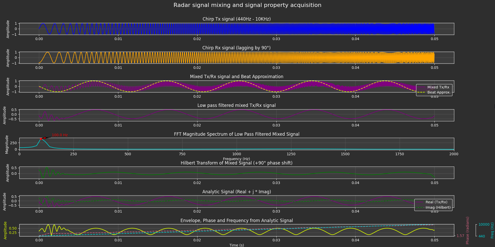

# RADAR FMCW Digital Signal Proccessing

---

---

As a continuation on the RADAR data clustering project and a preparation for a self designed radar system, a physics and math exploration of RADAR Frequency Modulated Continuous Wave is done. During this exploration, the researched information is documented and simulated (See github link below). The main purpose of this study is to gain an understanding on the signal path and specifically, which operations are needed to calculate distance from a transmitted and received signal. 

## Github repository
[Github repository](https://github.com/FRniels/Radar-controlled-pan-tilt-system/blob/main/Documentation/Math/Radar_Signal_Mixing/fmcw_radar_signal_mixing.md)
