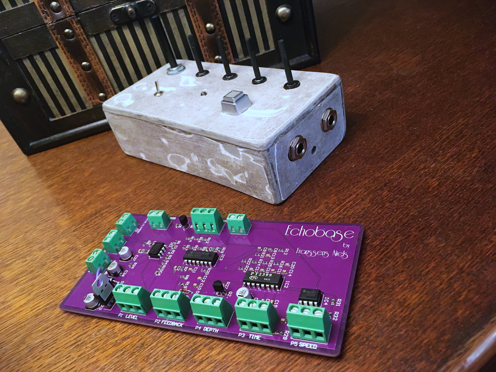

# Audio delay pedal

---

---

This project concludes my very first PCB and housing design. This 'Echobase' pedal is an audio delay pedal design based around the old PT2399 chip. The circuit itself is not designed by me (designer unknown). PCB design was done using Altium Designer. The housing is custom handmade but is accompanied by an autodesk Fusion file so it could also be 3D printed.

This delay pedal can turn on/off the delay effect, with the option of letting the delay bleed out or not when turned off. This can be controlled via both switches. The delay itself can be configured via the potentiometers for the following properties: delay volume , delay time, delay depth and the delay speed, however, the delay speed control has been found non working for which the reason has not been investigated. 

## Github repository
[Github repository](https://github.com/FRniels/Echobase-delay-pedal)
