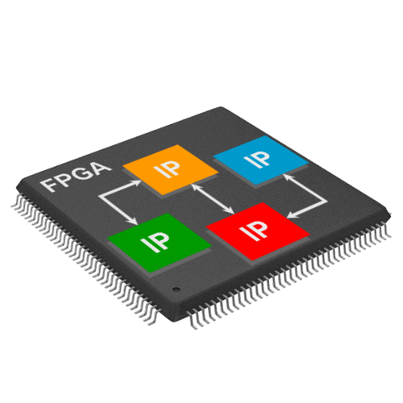
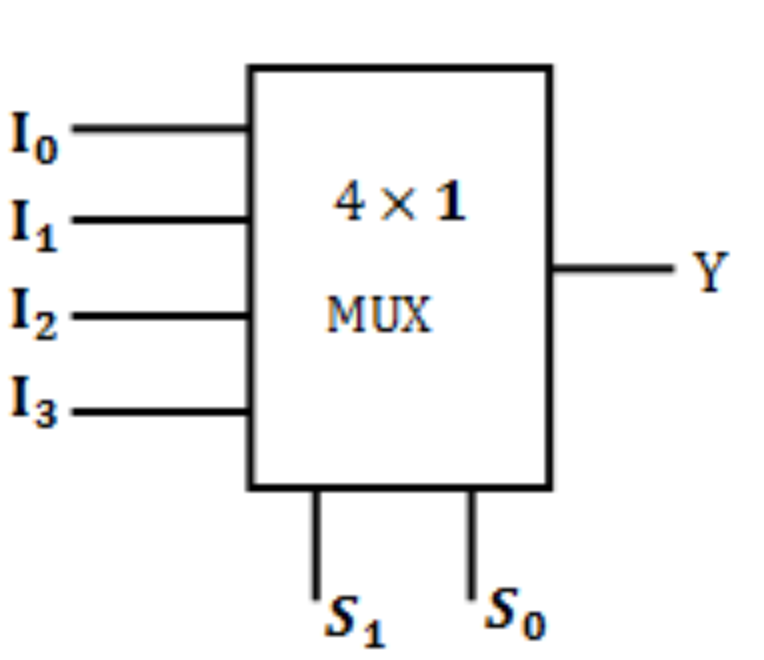
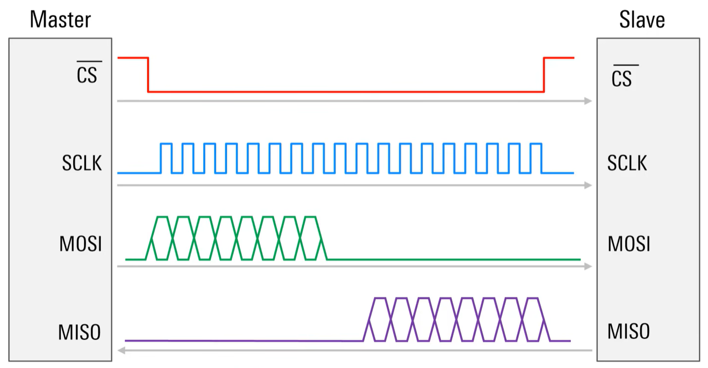
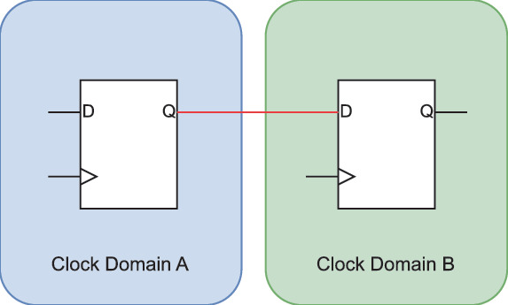
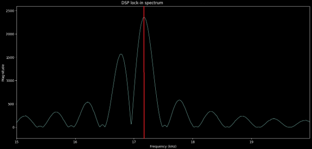
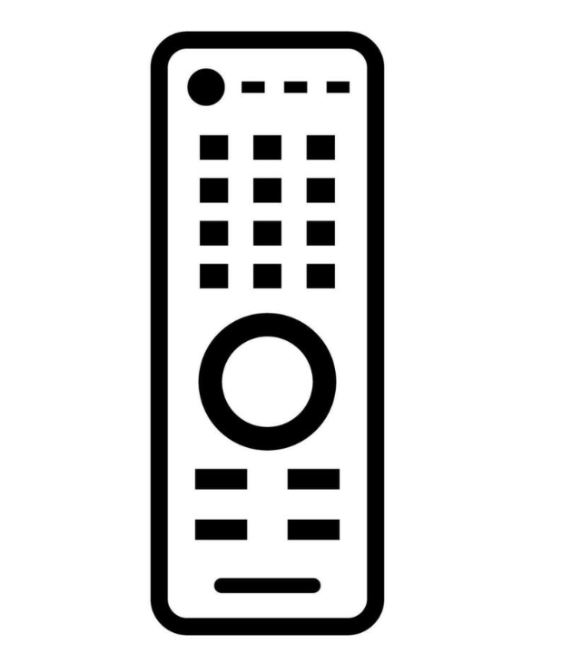

# FPGA Custom RTL Library

---

<table width="50%" border="0">
  <tr>
    <td width="50%" align="center">
      
    </td>
    <td width="50%">
      Throughout the past 3 years (2023-2026), my main focus has been around FPGA design, and more specifically RTL design. My focus on FPGA development led to a vast amount of research, experimentation, numerous prototypes, actual designs (of which a small amount is mentioned in this portfolio) and a custom library of IPs.
      The attractiveness of this custom RTL IP library is the full  ownership, which gives full control over properties like  determinism,  latency, resource and power usage. Alongside this,  vendor independency is created too a large degree, which allows  for immediate migration between different hardware and development  tools with relative ease.  
      Where applicable, IPs are implemented to have proper protocol  agnosticity and clearly seperated control and data paths. For  example, most streaming IPs are chosen to implement the AXI stream  protocol, as it is widely used, but the custom nature of the RTL  provides the opportunity to modify the IP to implement other  protocols.  
      As a side note, and as this library is an ongoing work of progess  not all IPs are fully implemented to include all possible  functionalities. Throughout the development of this library,  choices where made to deliberately leave out functionality or  implementing only the necessary parts at the time due to time  constraints. However, in those cases, the remaining  functionalities that did not make it in the current implementation  are to be added  with relative ease.  
      This IP library will not be open-sourced as some parts of it  are used in private or production projects. However, i'm open for  contact and discussing collaborations or contributions on a  contract / freelance base.  
      As to give an idea what can be found in this IP library, a slight  overview is given below. 
    </td>
  </tr>
</table>

---

<table border="0">
  <tr>
    <td>
      <b>Primitives:</b>
      <ul>
        <li>Multiplexers: MUX (a)sync</li>
        <li>Buffers: FIFO</li>
        <li>Shift registers: SIPO, PISO, PIPO, ...</li>
        <li>Counter / timer / PWM</li>
        <li>Pulse / strobe generator</li>
        <li>ROM / Dual port RAM</li>
      </ul>
    </td>
    <td align="center">
      
    </td>
  </tr>
</table>

---

<table border="0">
  <tr>
    <td align="center">
      
    </td>
    <td>
      <b>Communication:</b>
      <ul>
        <li>UART</li>
        <li>I2C</li>
        <li>SPI / QSPIv
        <li>PS/2</li>
        <li>VGA</li>
        <li>Line encodings</li>
      </ul>
    </td>
  </tr>
</table>

---

<table border="0">
  <tr>
    <td></td>
    <td>
      <b>Clock Domain Crossing:</b>
      <ul>
        <li>FlipFlop sync</li>
        <li>Pulse stretch sync</li>
        <li>CDC handshake bridge</li>
        <li>Async FIFO (cummings architecture)</li>
      </ul> 
    </td>
  </tr>
</table>

<table border="0">
  <tr>
    <td align="center">
      
    </td>
    <td>
      <b>Digital Signal Processing</b>
      <ul>
        <li>RGB to Grayscale</li>
        <li>Audio: volume, delay, distortion,...</li>
        <li>Average / moving average</li>
        <li>FIR Low Pass Filter</li>
        <li>Lock-in amplifier</li>
      </ul>
    </td>
  </tr>
</table>

---

<table border="0">
  <tr>
    <td>
      <b>Control IPs</b>
      <ul>
        <li>Interface controller</li>
        <li>Register map </li>
      </ul>
    </td>
  <tr>
  <tr>
    <td></td>
  </tr>
</table>
