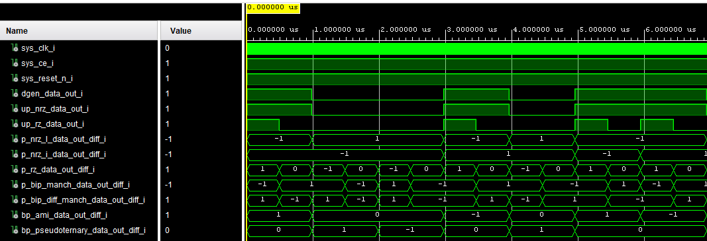

# FPGA RTL Line Encoding

---

---

This project concludes a comprehensive collection of the basic line encodings written in VHDL, with no or the lowest latency possible. This project evolved from a school assignment in which 2 line encodings needed to be implemented on a PSOC6 microcontroller, in which one encoding needed to be implemented by using its SmartIO fabric. This sparked the interest to implement these encodings into a proper FPGA, which also adds on to my personal RTL IP library. 
