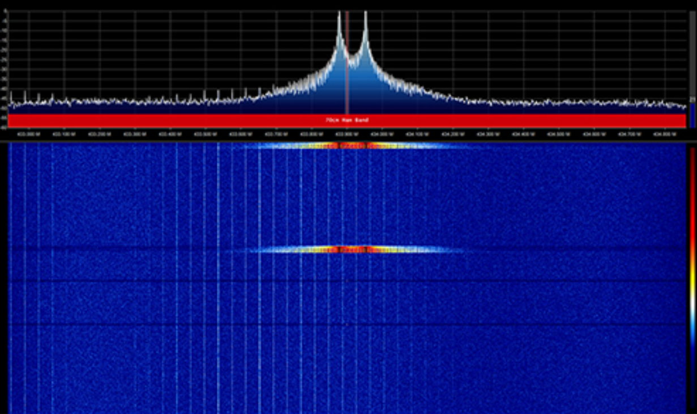

# Garageport Replay Attack

---

---

Note: this is for educational purpose only!

This project concludes a wireless remote replay attack which started out as an extension on a school assignment about basic SDR analysis of a captured signal.

The captured signal in the school assignment was the signal transmitted to an old automatic garage port. The first analysis of the captured signal instantly revealed  that the garage did not use any forms of security like rolling keys. The signal was not just recorded and replayed, instead, the protocol was recorded and analyzed properly from which the replayed signal is rebuilt from this information. This was done to further prove the captured signal was properly analyzed and reconstructed. This approach thus only works on signals that have bad or no security at all.

## Github repository
[Github repository](https://github.com/FRniels/MarantecM_Garageport_RPI4B_Replay_Attack/tree/main)
