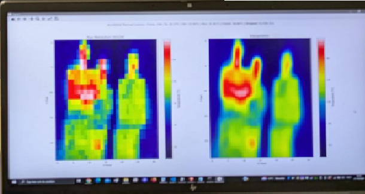

# Melexis MLX90640 Infrared Array

---

---

In a school related project in association with uHasselt Bio research, an Melexis MLX90640 infrared sensor array was one of the included sensors.  This project revolved around gathering more info about why and when bats migrate from one cavity wall to another. Because bats group together, it should be possible to retreive a heat signature. The actual product is never tried on the real usecase but is verified working in normal test conditions.
First of all, the driver code from Melexis was implemented on a raspberry pi pico W which allows for WiFi connection as wired ethernet connections would not be available at the target  locations. As a second step, the infrared array data was sent over UDP to a laptop which applies some postprocessing which includes things like interpolation to smooth out the raw data. Power consumption also was of concern because the target locations will not always provide reachable power outlets. To reduce in power consumption, a PIR sensor was added which allowed the infrared sensor and WiFi connection to go idle when no trigger has occurred for a configurable amount of time.

