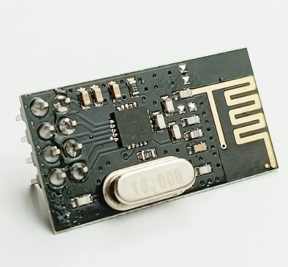

# NRF24L01+ RP Pico C/C++ Driver

---

---

This project concludes a custom RP Pico C/C++ SDK driver to provide lightweight wireless communication compared to traditional WiFi and Bluetooth. Sometimes one only needs very simple low bandwidth information transfer to accomplish a goal. WiFi and Bluetooth immediately comes with a lot of overhead and power consumption, thus a module like the NRF24L01+ would be a suitable alternative depending on the situation at hand. Altough this is not a portable driver in itself, the choice of writing a custom driver using the C/C++ SDK of the RP Pico instead of Arduino libraries, is made so that it should be relatively easy to port to other microcontrollers. The only change to be made is to adjust to the I2C implementation of the targetted microcontroller.

## Github repository
[Github repository](https://github.com/FRniels/nRF24L01-Lib-RP-Pico-SDK)
