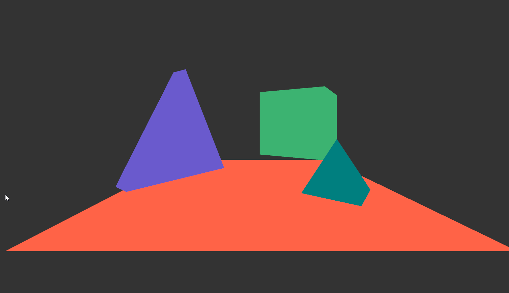

# OpenGL Basic 3D setting + Camera Movement

---

---

This project is an continued exploration of OpenGL C++ programming i did in my associate degree programming. It continued on learning how to get a basic 3D scene set up, explore numerous transformations using Transformation Matrices on world objects and camera position. The following github repository contains multiple projects in order, with the information on how to set up Visual Studio. The latest version is the camera movement version, which can be found in a seperate branch OpenGL_Camera_Movement, all other versions are to be found in the main branch. The main readme shows the project order to follow when wanting to learn the basics of OpenGL.

## Github repository
[C:\Users\11307533\Downloads\OpenGL_Basic3D_CameraMovement.png](https://github.com/FRniels/Cpp_OpenGL_SpinningCube)
