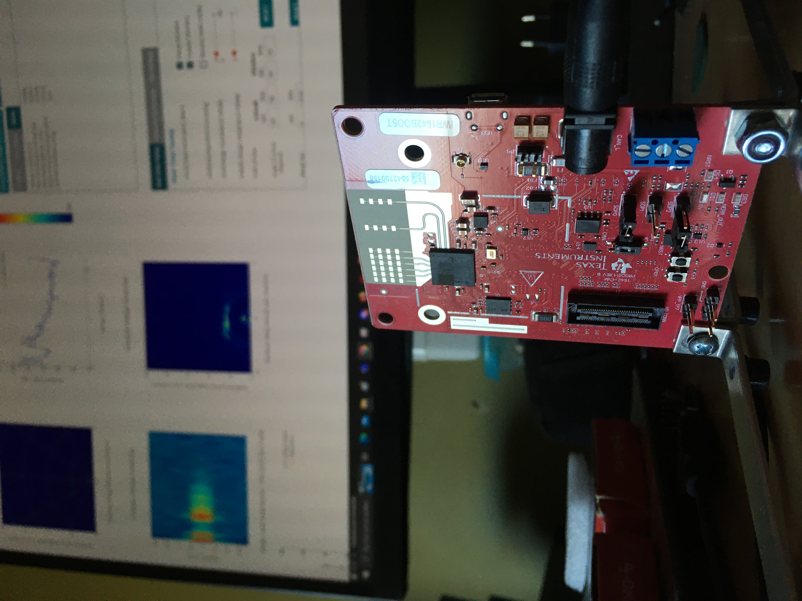
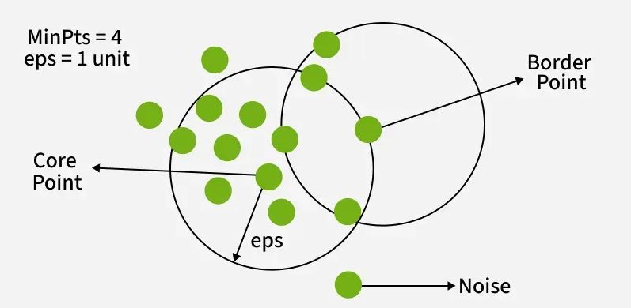
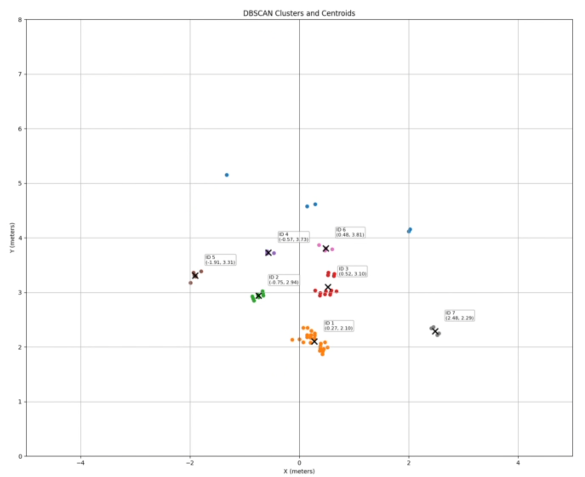
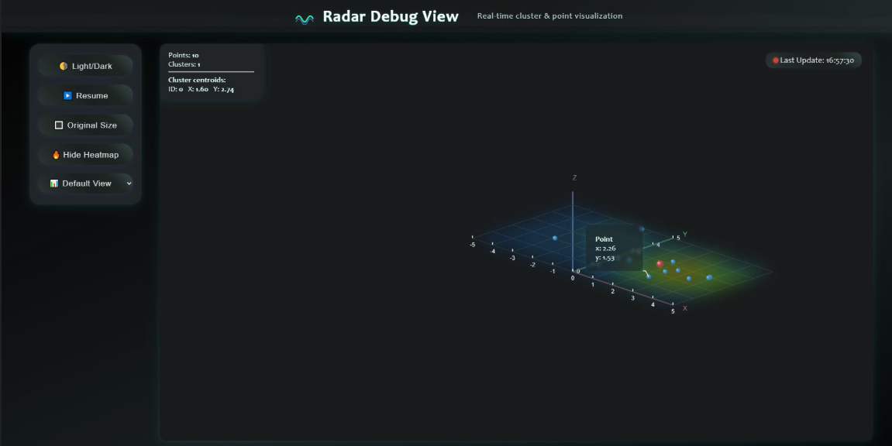

# RADAR Data clustering

---

<table>
  <tr>
    <td align="center">
      
    </td>
    <td>
      This project is a continuation on a school project that concluded RADAR control of a spotlight, with the purpose of tracking an actor on stage. Learning basic RADAR FMCW physics and the used TI IWR1642 SOC, development environment and source code was a major task to overcome. Time restriction led to this project not being finished, but well on its way. The spotlight was capable of being controlled by providing it coordinates and the RADAR system was able to send out its detected data over SPI. To actually track a human being, the RADAR data still needed further processing in the likes of data clustering and cluster tracking. This continuation project mainly focusses on RADAR data clustering, specifically DB-scan, this with accompanying self developped human interfaces as a way of presenting RADAR data to the end user and developer.
    </td>
  </tr>
</table>

---

<table>
  <tr>
    <td>
      The choice for using DB-scan as clustering algorithm was  driven by making a comparison to the more lightweight K-means cluster algorithm. In this comparison, DB-scan came out the strongest because of it handling arbitrary data point shapes that will occur in an on-stage setting better than K-means.
    </td>
    <td align="center">
      
    </td>
  </tr>
</table>

---

<table>
  <tr>
    <td align="center">
      
    </td>
    <td>
      A first version of the accompanying GUI serves only the purpose of lightweight plotting and extracting valuable data. This GUI version is thus geared purely towards the developer and not to the end user.
    </td>
  </tr>
</table>

---

<table>
  <tr>
    <td>
      Alongside the basic python plot of the captured and clustered RADAR data, an extensive web user interface is made. The web interface allows for different views of the axis system. This includes a static top down view, a static 3th person view, dynamic 3th person view looking in the direction of the radar and finally these 3 views displayed all at once. The user can also activate a heatmap that easily reveils areas of high point density. The amount of detected points and amount of clusters are also reported along side the cluster center coordinates. Each individual point can be selected to reveil its specific coordinate. 
    </td>
  <tr>
  <tr>
    <td></td>
  </tr>
</table>

## Github repository
[Github repository](https://github.com/FRniels/Radar-controlled-pan-tilt-system/tree/main)
