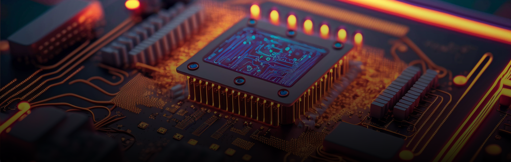

# Portfolio — Niels Franssens

Welcome to my portfolio repository. This is the central place where I collect and showcase the work I've done — both during my studies at PXL College and on my own spare time.

---

## Contents

### 📁 PXL_Projects
Projects completed as extra assignments on top of the curriculum at PXL, which include a BOMB-case game, FPGA RTL encryption and teaching a fellow student.

### 📁 PXL_Events
In this folder events like a visit to Expos and companies can be found.

### 📁 Personal_Projects
This folder includes subjects I research and/or built on my own initiative, outside of school or as a further extension on certain assignments. 
The three main subjects to be found in here are FPGA development, and specifically RTL development, Digital Signal Processing and RF development like RADAR systems.
These subjects reflect my personal interests and are the skills and knowledge i hone in on the most.

### 📁 Bachelor's thesis
This folder shows the thesis abstract as a way to give some information.
As this thesis falls under NDA, it is not possible to share further detail.
Gaining access to further detail can always be discussed.

---